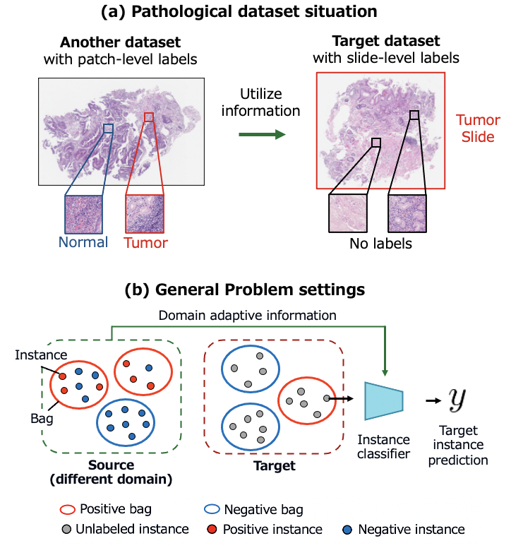
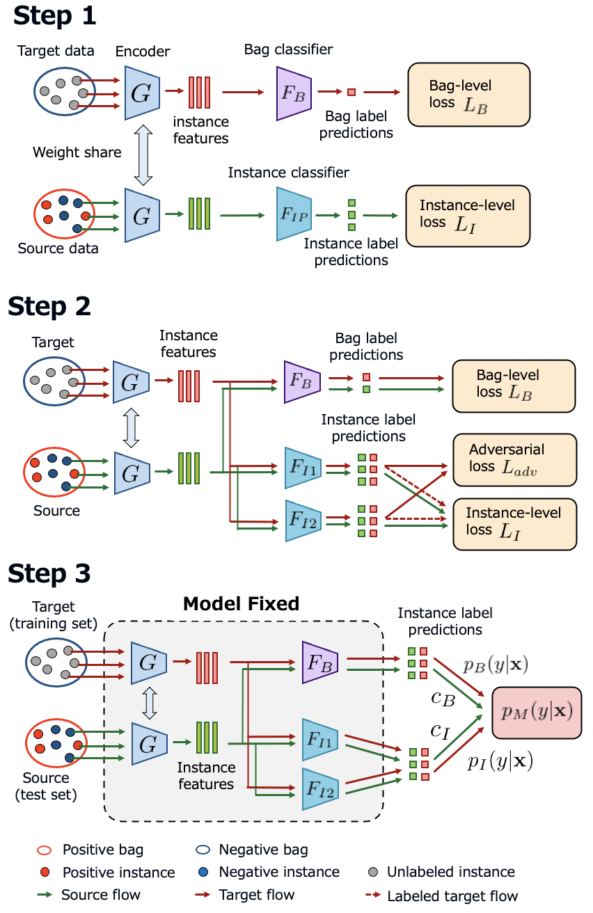
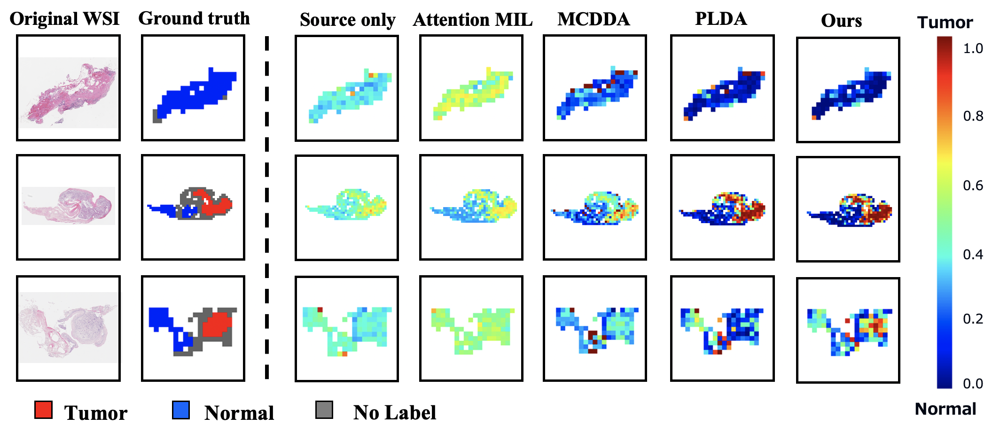

# Domain Adaptive Multiple Instance Learning for Instance-level Prediction
Implementation of DAMIL (Domain Adaptive Multiple Instance Learning)  
Accepted by [ISBI 2023](https://2023.biomedicalimaging.org/) (Oral)  
[[Paper Link (Arxiv)]](https://arxiv.org/abs/2304.03537)  

## Overview
This is an effective method to improve the performace of pathological image analysis without increasing the annotation cost.

We proposed a new task setting with two datasets.
- the target dataset with only coarse labels  
- the source dataset with full annotation  

Our goal is to classify the target dataset with good accuracy.



<br>

This method combined multiple instance learning (MIL) and domain adaptation (DA) techniques. In addition, we introduced highly reliable pseudo-labeling method. Our pipeline has three steps.

1. Pre-training
2. Training with the DA loss and labeled target data
3. Gicing pseudo-labels



<br>

In our paper, we proved the effectiveness of our method with real-world pathological image dataset.



<br>

## Getting Started
Python ~= 3.9 is required.

If you have poetry environment,
```
poetry install
cd src/
poetry run python -m main_damil [LOG_OUTPUT_DIR]
```

Otherwise
```
pip install -r requirements.txt
cd src/
poetry run python -m main_damil [LOG_OUTPUT_DIR]
```

## Note
- Experimental logs and plots are saved in `result_log/` directory.
- In our paper, we conducted experiments with Digit dataset, Visda Dataset, and Pathological dataset. In this repository, the digit dataset is available.

## Citation
If you use this code for your research, please cite our papers.

```
@article{takahama2023damil,
  title={Domain Adaptive Multiple Instance Learning for Instance-level Prediction of Pathological Images},
  author={Shusuke, Takahama and Yusuke, Kurose and Yusuke, Mukuta and Hiroyuki, Abe and Akihiko, Yoshizawa and Tetsuo, Ushiku and Masashi, Fukayama and Masanobu, Kitagawa and Masaru, Kitsuregawa and Tatsuya, Harada},
  journal={arXiv preprint arXiv:2304.03537},
  year={2023}
}
```
